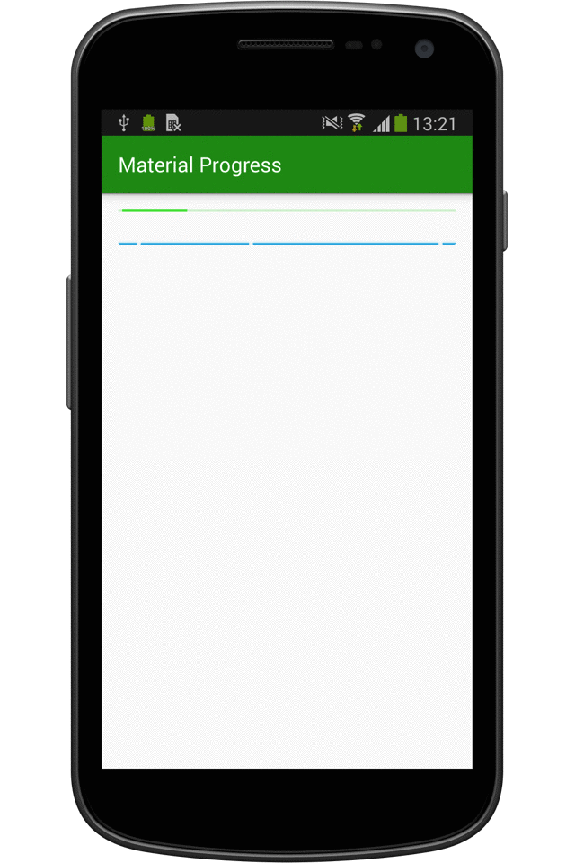

##开源项目

###Android 个性化控件(View)篇

####一、ProgressBar

1. [Material ProgressBar](http://www.jianshu.com/p/9d329bf2cc44)

####二、Material Design

1. [Android Design Support Library完整介绍](http://inthecheesefactory.com/blog/android-design-support-library-codelab)

####三、Animations 

1. [Demo of the onboarding animations of Yahoo News App](https://github.com/rahulrj/YahooNewsOnboarding)

###Android 个性化组件(Component)篇

####一、FlycoTabLayout
1. [An Android TabLayout Lib has two kinds of TabLayout at present.](https://github.com/H07000223/FlycoTabLayout)

###Android 个人开源项目

1. [An application about movies with material design](https://github.com/saulmm/Material-Movies)
2. [一款基于Google Material Design设计开发的Android客户端，包括新闻简读，图片浏览，视频爽看 ，音乐轻听以及二维码扫描五个子模块。项目采取的是MVP架构开发，由于还是摸索阶段，可能不是很规范。但基本上应该是这么个套路，至少我个人认为是这样的~恩，就是这样的！](https://github.com/tb-yangshu/SimplifyReader)

###巨人的肩膀
**GitHub上的各大开源库的收录和分析**

[Trinea/android-open-project · GitHub](https://github.com/Trinea/android-open-project)

