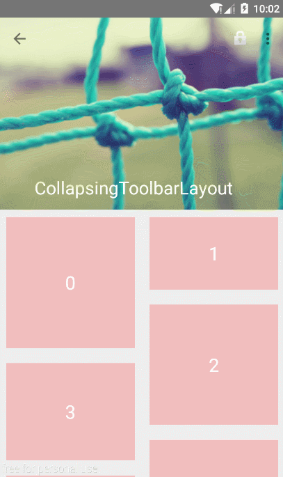

##开源项目

###Android 个性化控件(View)篇
---

####一、ProgressBar

1. [Material ProgressBar](http://www.jianshu.com/p/9d329bf2cc44)

	>

####二、Animations 

1. [Demo of the onboarding animations of Yahoo News App](https://github.com/rahulrj/YahooNewsOnboarding)
	
	>

2. [一个提供了很多 Android 动画效果的实例的Demo项目](https://github.com/hitherejoe/animate)

####二、ImageView

1. [一个支持在图片上显示一个徽章的ImageView](https://github.com/yesidlazaro/BadgedImageview)

	>

2. [一个可以由模糊慢慢渐近显示为清晰图的控件](https://github.com/wingjay/BlurImageView)
	
	>

3. [Android 加载大图 可以高清显示10000*10000像素的图片，轻松实现微博长图功能](https://github.com/LuckyJayce/LargeImage)

####三、CalendarView

1. [一款在日历和议事日程间添加简易导航效果的 Android 控件](https://github.com/Tibolte/AgendaCalendarView)

	>  

####四、Theme

1. [一个增强冷启动体验的库](https://github.com/DreaminginCodeZH/MaterialColdStart)

	>

2. [一种完全无侵入的换肤方式，支持插件式和应用内，无需重启Activity](https://github.com/hongyangAndroid/AndroidChangeSkin)

	>

####五、WheelView

1. [一个刻度滚轮控件](https://github.com/lantouzi/WheelView-Android)

	>

####六、Highlight

1. [一个用于app指向性功能高亮的库](https://github.com/hongyangAndroid/Highlight)

	>

####七、PickerView

1. [可实现三级联动的选择器，高仿iOS的滚轮控件](https://github.com/alafighting/CharacterPickerView)

	>

####八、Material Design

1. [Material Design之CollapsingToolbarLayout使用](http://android.jobbole.com/82193/)

2. [Material Design之CoordinatorLayout+AppBarLayout实现上滑隐藏ToolBar](http://android.jobbole.com/82188/)

###Android 个性化组件(Component)篇
---

####一、FlycoTabLayout
1. [An Android TabLayout Lib has two kinds of TabLayout at present.](https://github.com/H07000223/FlycoTabLayout)

	>

###Bmob即时聊天开发组件
---
[Bmob即时聊天开发组件](https://github.com/bmob/bmob-android-im-sdk)

**界面效果**

###Android 个人开源项目
---
1. [An application about movies with material design](https://github.com/saulmm/Material-Movies)

2. [Material Design设计开发的Android客户端](https://github.com/tb-yangshu/SimplifyReader)

	>一款基于Google Material Design设计开发的Android客户端，包括新闻简读，图片浏览，视频爽看 ，音乐轻听以及二维码扫描五个子模块。项目采取的是MVP架构开发，由于还是摸索阶段，可能不是很规范。但基本上应该是这么个套路，至少我个人认为是这样的~恩，就是这样的！

###巨人的肩膀
---
1. GitHub上的各大开源库的收录和分析

	>[Trinea/android-open-project · GitHub](https://github.com/Trinea/android-open-project)

2. AndroidOpenSourceProject

	>[Android Open Source Project dedicated to collect high-quality Android open source project.](http://www.androidopensourceproject.com/)

3. AndroidLibs

	>[收集Android开发中优秀的开源组件库](https://github.com/XXApple/AndroidLibs)

4. awesome-android

	>[android libs from github](https://github.com/snowdream/awesome-android)

5. [Code4App](http://a.code4app.com/category)